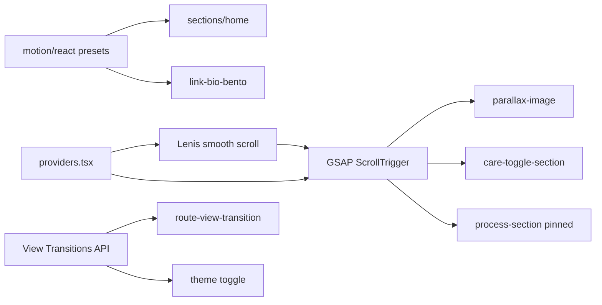

# Architecture — Grape Clinic

Documentação técnica do frontend. Para produto e tom de marca, ver [`PRODUCT.md`](PRODUCT.md). Para direção visual, ver [`DESIGN.md`](DESIGN.md). Para instalação e scripts, ver [`README.md`](README.md).

## Stack

| Camada | Tecnologia |
| --- | --- |
| Framework | Next.js 16 (App Router) |
| UI | React 19, TypeScript |
| Estilo | Tailwind CSS 4, tokens em `globals.css` |
| Motion UI | `motion/react` |
| Scroll storytelling | GSAP 3 + ScrollTrigger |
| Scroll suave | Lenis (desligado com `prefers-reduced-motion`) |
| Tema | next-themes + View Transitions API |

## Estrutura de pastas

```
src/
├── app/                      # Rotas, layout global, globals.css
│   ├── page.tsx              # Home (/)
│   └── hub/page.tsx          # Hub (/hub)
├── components/
│   ├── layout/               # Chrome: header, footer, providers, intro, nav
│   ├── sections/home/        # Seções modulares da home (12 arquivos)
│   ├── sections/             # Orquestradores + hub + blocos reutilizáveis
│   ├── motion/               # Reveal, StaggerReveal, RevealItem
│   ├── media/                # ParallaxImage, HeroBackground, YouTubeEmbed
│   ├── interaction/          # FAQ accordion
│   └── ui/                   # Button, ExternalArrow, LiquidGlassSurface
├── content/                  # site.ts (copy/config), media.ts (assets)
├── hooks/                    # reduced-motion, scroll-lock, media-query, intro
├── lib/
│   ├── motion/               # Tokens, presets, GSAP — ver MOTION.md
│   ├── layout.ts             # Ritmo de seção + gutters
│   ├── typography.ts         # Escalas tipográficas
│   ├── navigation/           # Hash scroll + Lenis offset
│   ├── intro/                # Site intro, preload de assets críticos
│   ├── lenis.ts              # Singleton Lenis
│   ├── z-index.ts            # Escala semântica de camadas
│   ├── a11y/                 # focus-trap
│   └── theme/                # View transition do theme toggle
├── registry/                 # Magic UI (animated-theme-toggler)
└── styles/                   # CSS de transição (intro, tema, rotas, nav)
```

## Fluxo de motion



### Regra de ouro

| Caso | Ferramenta |
| --- | --- |
| Entrada, hover, accordion, menu | `motion/react` + `Reveal` / `StaggerReveal` |
| Parallax de imagem | GSAP ScrollTrigger em `ParallaxImage` |
| Pin / scroll storytelling | GSAP ScrollTrigger + `scrollTriggerScroller()` |
| Scroll suave | Lenis (global) |
| Troca de rota | React `ViewTransition` + CSS em `route-view-transition.css` |
| Troca de tema | View Transitions API em `run-theme-view-transition.ts` |
| Hash cross-page (`/hub` → `/#contato`) | `HashScrollHandler` + retry em `scroll-to-hash.ts` |

**Nunca** chamar `gsap.registerPlugin` fora de [`gsap.ts`](src/lib/motion/gsap.ts).

## Shell global

[`layout.tsx`](src/app/layout.tsx): fonts (Montserrat + Geist Mono), preload de hero, SiteIntro flash guard.

[`app-chrome.tsx`](src/components/layout/app-chrome.tsx): Header, `<main>`, Footer, FAB WhatsApp. Layout especial para `/hub` (viewport fixo).

[`providers.tsx`](src/components/providers.tsx): ThemeProvider, Lenis + scrollerProxy, MotionConfig, SiteIntro, HashScrollHandler.

## Home premium

[`premium-home.tsx`](src/components/sections/premium-home.tsx) orquestra as seções em ordem fixa:

1. HeroSection → 2. CareToggleSection → 3. VisualBreakSection → 4. CarePathsSection → 5. TimelineSection → 6. ProcessSection → 7. FounderStatementSection → 8. VideoStorySection → 9. PatientStoriesSection → 10. FaqSectionAlt → 11. ClosingCtaSection → 12. ClinicGallerySection

Cada seção é um arquivo em `sections/home/*`. **Não alterar ordem nem copy** sem aprovação de produto.

## Hub

Rota `/hub` → [`link-bio-bento.tsx`](src/components/sections/link-bio-bento.tsx).

Redirect permanente `/link-bio` → `/hub` em [`next.config.ts`](../next.config.ts).

Layout bento: painel intro + cards featured/support. Animação via `StaggerReveal` / `RevealItem`. Links internos usam hash da home; externos (Maps, Instagram, YouTube) abrem em nova aba.

## Conteúdo

| Arquivo | Responsabilidade |
| --- | --- |
| [`content/site.ts`](src/content/site.ts) | Copy, nav, FAQs, links externos, `siteConfig` |
| [`content/media.ts`](src/content/media.ts) | Mapa de imagens/vídeos (`/images/opt/...`) |
| [`content/home-care-paths.ts`](src/content/home-care-paths.ts) | Seção «Quatro frentes de cuidado» |
| [`content/home-scroll-nav.ts`](src/content/home-scroll-nav.ts) | Nav lateral da home por hash |

## Mídia

Ver [`docs/MEDIA.md`](docs/MEDIA.md). Resumo: masters em `public/images/sources/`, servidos via `public/images/opt/` gerado por `npm run optimize:images`.

## Escopo fase 1 vs P2

| Incluído (fase 1) | Adiado (P2) |
| --- | --- |
| `/`, `/hub`, shell global | `/protocolo-emagrecimento`, `/emagrecimento` |
| Motion padronizado home + hub | Motion nas institucionais |
| Route view transitions | Fontes locais (`docs/assets/typography/`) |
| Pipeline mídia (sharp/ffmpeg) | Backend do formulário / CRM |
| Docs técnicas | CI/E2E visual |

## Scripts

```bash
npm run dev
npm run build
npm run typecheck
npm run lint
npm run optimize:media
```

## Convenções

- Imports de animação UI: `from "motion/react"`
- Tokens: `from "@/lib/motion"`
- Seções da home: sufixo `-section.tsx`, export nomeado `*Section`
- Copy e nav: apenas [`content/site.ts`](src/content/site.ts)
- Assets: [`content/media.ts`](src/content/media.ts) + [`scripts/optimize-images.config.mjs`](../scripts/optimize-images.config.mjs)
- Path alias: `@/*` → `src/*`
