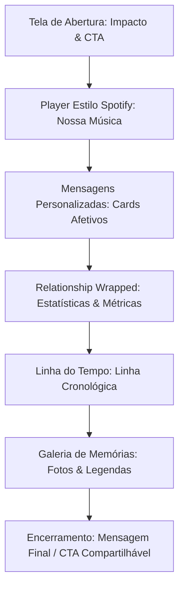

# Projeto: Relationship Wrapped ❤️ (Dia dos Namorados)

Este documento descreve a visão do produto, fluxo da experiência, componentes técnicos e estrutura de arquivos para a Landing Page (LP) de retrospectiva de relacionamento, inspirada no conceito visual e interativo do **Spotify Wrapped**.

---

## 1. Objetivo do Projeto

Criar uma página web personalizada, interativa e de alta qualidade estética que narra a história do relacionamento de forma emocional e gamificada. A navegação e o design serão mobile-first, inspirados na experiência fluida, dinâmica e cheia de dados do Spotify Wrapped.

---

## 2. Fluxo da Experiência

A experiência é dividida em seções sequenciais e envolventes, projetadas para manter o impacto emocional do início ao fim:



### 2.1. Tela de Abertura
* **Conteúdo**: Mensagem de impacto de introdução à retrospectiva do casal.
* **Ação**: Botão de chamada para ação (CTA) marcante para iniciar a experiência.

### 2.2. Player Estilo Spotify
* **Conteúdo**: Exibição de uma música significativa para o casal com uma capa de álbum personalizada.
* **Interface**: Reprodutor visual semelhante ao Spotify (botão play/pause funcional ou simulado, barra de progresso em animação, tempos decorridos).
* **Propósito**: Estabelecer conexão emocional imediata através da trilha sonora.

### 2.3. Mensagens Personalizadas
* **Conteúdo**: Cartões flutuantes ou em estilo "stories" com declarações, frases sobre momentos especiais e textos afetivos.
* **Interação**: Animações suaves de transição entre cada frase.

### 2.4. "Relationship Wrapped" (Estatísticas do Casal)
* **Conteúdo**: O ponto central da experiência de gamificação.
* **Métricas Sugeridas**:
  * Tempo juntos (ex: "X mil horas compartilhadas").
  * Quantidade de encontros, viagens feitas ou mensagens trocadas.
  * Comparativo divertido (ex: "Juntos, nosso nível de sintonia é maior do que 99.9% dos casais").

### 2.5. Linha do Tempo (Timeline)
* **Conteúdo**: Exibição cronológica interativa de marcos históricos importantes (Ex: Primeiro encontro, primeira viagem, datas comemorativas, formaturas).
* **Interface**: Fotos associadas a cada ano/mês com textos descritivos curtos.

### 2.6. Galeria de Memórias
* **Conteúdo**: Mural de fotos selecionadas dispostas de forma elegante e fluida.
* **Interface**: Cartões com legendas afetivas e transições ao rolar a tela.

---

## 3. Componentes Necessários

* **Landing Page Responsiva (Mobile-First)**: Estrutura otimizada para telas de celulares, onde a experiência do Spotify Wrapped brilha mais.
* **Player Visual Spotify**: Componente customizado imitando a interface do player do app (inclusive com oscilador de áudio ou espectro animado).
* **Timeline Interativa**: Linha vertical ou horizontal animada por scroll.
* **Cards de Mensagens**: Slides interativos para textos poéticos.
* **Seção de Estatísticas (Wrapped Cards)**: Grid dinâmico apresentando números importantes do casal de forma chamativa.
* **Navegação por Etapas**: Transições de tela cheia (estilo slides/stories) ou scroll contínuo e suave (usando Lenis + GSAP).

---

## 4. Estrutura de Arquivos Recomendada

Para isolar este projeto romântico da estrutura médica existente da Grape Clinic:

```
src/
├── app/
│   └── namorados/
│       └── page.tsx                    # Rota e página principal da retrospectiva (/namorados)
├── components/
│   └── sections/
│       └── namorados/                  # Componentes exclusivos
│           ├── opening-hero.tsx        # Tela de abertura
│           ├── spotify-player.tsx      # Player de áudio interativo
│           ├── message-cards.tsx       # Transição de cartas de amor
│           ├── wrapped-stats.tsx       # Estatísticas e dados divertidos
│           ├── timeline.tsx            # Linha do tempo dos marcos importantes
│           └── memories-gallery.tsx    # Galeria de fotos com efeito premium
├── content/
│   └── namorados.ts                    # Dados parametrizados do casal
└── styles/
    └── namorados.css                   # Estilos exclusivos (cores rosa/vinho/neon, fontes e player)
```

---

## 5. Dados Parametrizados (`src/content/namorados.ts`)

Todas as informações pessoais devem ser concentradas em um único arquivo de configuração para facilitar a manutenção e customização:

```typescript
export const namoradosData = {
  coupleNames: {
    first: "Seu Nome",
    second: "Nome do Parceiro(a)",
  },
  startDate: "YYYY-MM-DD", // Usado para calcular dias e horas juntos dinamicamente
  mainSong: {
    title: "Nome da Música",
    artist: "Nome do Artista",
    coverUrl: "/images/namorados/capa-musica.jpg",
    audioUrl: "/audio/nossa-musica.mp3", // Opcional: áudio real
  },
  stats: [
    { value: "3+", label: "Anos de história" },
    { value: "12.4K+", label: "Horas de conversas" },
    { value: "5", label: "Viagens inesquecíveis" },
    { value: "99.9%", label: "De sintonia garantida" },
  ],
  timeline: [
    {
      date: "DD/MM/YYYY",
      title: "O Primeiro Olhar",
      description: "O dia em que tudo começou, lá no...",
      image: "/images/namorados/timeline-1.jpg",
    },
    // Outros marcos...
  ],
  messages: [
    "Cada segundo ao seu lado é uma nova música favorita.",
    "Das conversas de madrugada até as viagens de última hora...",
    "Você é a minha melhor retrospectiva de todos os anos.",
  ],
  gallery: [
    { src: "/images/namorados/galeria-1.jpg", alt: "Nós dois no parque", caption: "Nossos domingos favoritos" },
    // Outras fotos...
  ]
};
```

---

## 6. Ajustes de Integração com o Projeto Atual

Para que a página funcione perfeitamente sem carregar o branding da clínica:
1. **Modificar o Layout Chrome** em [app-chrome.tsx](file:///Users/igsribeiro/Desktop/grape/Grape-LP/src/components/layout/app-chrome.tsx):
   * Ocultar `<Header />`, `<Footer />` e `<FloatingWhatsApp />` quando o `pathname` iniciar com `/namorados`.
2. **CSS Isolado**:
   * Utilizar variáveis exclusivas no arquivo de estilo para definir tons de rosa profundo, roxo escuro e tons de neon inspirados no Wrapped, sem poluir os estilos globais em `globals.css`.
